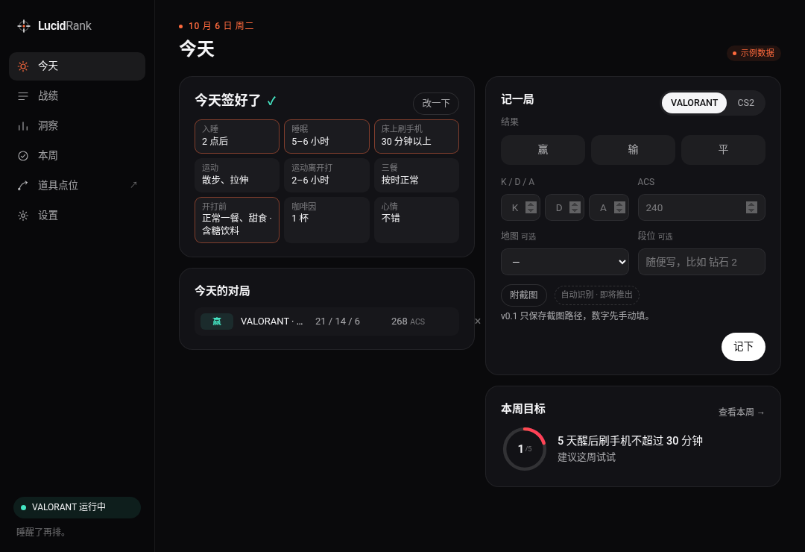

# LucidRank 桌面版（Windows 原型 v0.1）

给 VALORANT / CS2 玩家的小工具：开打前花 10 秒点 8 下，记一下昨晚几点睡、睡了多久、醒来刷了多久手机、运动、吃饭、咖啡因和心情；打完记一笔战绩。攒够一段时间后，它会拿**你自己的**数据对比，告诉你哪个习惯最影响你的发挥，每周给一个从你现状出发的小目标。

> 这是第一个能跑的原型。界面、功能和数据格式之后都可能变。



## 能做什么

| 功能 | 说明 |
| --- | --- |
| 托盘常驻 | 关掉主窗口后它待在系统托盘。托盘菜单：打开 / 现在签到 / 道具点位 / 退出。开机自启默认**关闭**，在设置里开。 |
| 游戏检测 | 每 5 秒看一次进程列表里有没有 `VALORANT-Win64-Shipping.exe` 或 `cs2.exe`。游戏启动且今天还没签到时，弹一个居中的签到小窗（聚焦一次）并发一条 Windows 通知。**每天最多弹一次**；小窗里有「今天不了」。 |
| 每日签到 | 和官网演示同一套题：入睡时间、睡眠时长、醒后床上刷手机、运动（练了会追问离开打多久）、三餐、开打前 2 小时吃了什么（可多选）、咖啡因、心情。点击或键盘 1–5，约 10 秒，点完自动关闭。 |
| 战绩记录 | 输 / 赢 / 平，K/D/A，ACS（VALORANT）或 ADR（CS2），地图和段位可选；可以附一张结算截图（只存文件路径，**自动识别 OCR 即将推出**，v0.1 不做）。 |
| 洞察 | 有签到又有对局的日子满 8 天后，按 睡不到 6 小时 vs 睡够 7 小时、1 点前 vs 1 点后睡、醒后刷手机超 30 分钟 vs 没超、运动 vs 没运动、咖啡因 2 杯以上 vs 以内，对比胜率和平均 ACS/ADR。数据不够时显示「还需要 N 天」。有「载入示例数据」按钮可以先看效果。 |
| 每周目标 | 纯规则，不用 AI。找出差距最大的 1–2 个习惯，列出你自己的数据作为依据，只给**一个**小目标，并且从你现在的水平往前挪一档（平时 2 点后睡的人，目标是「3 天在 2 点前睡」，而不是「11 点睡」）。显示本周进度 x/3（或 x/5）和上周结果。只谈作息和生活习惯，不涉及医疗、药物或补剂。 |
| 道具点位 | 单独窗口。选地图 / 英雄（CS2 为道具类型）/ 攻防 / 场景，看卡片列表、抽象小地图（站位、瞄点、投掷路线、落点）和三步说明，可收藏、标记「学会了」。检测到游戏时标题栏会显示。地图无法自动识别（我们不读游戏数据），所以由你来选，下次会记住。**全部为示例数据**，不是真实可用的 lineup，也没有使用任何 Riot / Valve 素材。 |
| 设置 | 语言（跟随系统 / 简体 / 繁體 / English）、开机自启、检测哪些游戏、导出 JSON、删除全部数据。 |

## 安全说明（反作弊）

LucidRank **只**通过系统的进程列表（`sysinfo`，只读进程名）判断 VALORANT / CS2 是否在运行。它：

- 不读写游戏内存，不打开游戏进程句柄；
- 不注入、不 hook 任何东西；
- 不在游戏上画覆盖层（overlay）；
- 不截屏、不录屏；
- 不模拟键盘鼠标输入。

它就是一个普通的独立窗口，像手机上的攻略一样，需要时 Alt+Tab 切出来看。和 Vanguard、Tencent ACE、VAC 都没有交集。

## 安装

1. 到 [Releases](../../releases) 下载 `LucidRank_0.1.0_x64-setup.exe`（也有 `.msi`）。
2. 安装包**没有代码签名**，Windows SmartScreen 会拦一下：点「**更多信息**」→「**仍要运行**」。
3. 默认装在当前用户目录，不需要管理员权限。需要 WebView2（Win10/11 一般自带，没有的话安装程序会自动下载）。

## 数据存在哪

全部只在本机，没有账号，不联网。

- 数据文件：`%APPDATA%\hk.lucidrank.desktop\lucidrank-data.json`
- 弹窗状态（今天有没有弹过 / 「今天不了」）：同目录下 `prompt-state.json`
- 设置 → 数据 里能看到完整路径、导出 JSON、或一键删除。
- 「一天」以早上 5 点为界，凌晨 1 点打的那局仍算前一天晚上。

卸载程序不会自动删除数据文件，想清干净可以先在设置里点「删除全部数据」。

## 开发

技术栈：Tauri v2（Rust）+ 纯 HTML/CSS/JS，没有前端框架。

```bash
npm ci
npm run tauri dev          # 开发运行
npm run tauri build        # 打包（Windows 上生成 NSIS .exe 和 .msi）
```

- 前端在 `src/`：`index.html`（主窗口）、`checkin.html`（签到小窗）、`lineups.html`（道具点位），文案在 `src/js/i18n.js`（sc / tc / en）。签到题目从概念网站复制而来。
- Rust 在 `src-tauri/src/lib.rs`：托盘、窗口、进程检测、本地 JSON 读写、通知、开机自启。
- 在普通浏览器里直接打开 `src/` 也能用（自带 Tauri API 的 localStorage 模拟），方便改界面：`cd src && python3 -m http.server 8765`，然后 `python3 tools/shots.py full` 生成 `shots/` 截图；`node tools/test_stats.js` 检查洞察和目标的规则。
- GitHub Actions（`.github/workflows/build-windows.yml`）在 `windows-latest` 上用 tauri-action 打包，上传为构建产物，并发布到预发布版本 `v0.1.0`。

## 已知限制（v0.1）

- 截图只保存路径，不识别内容（OCR 之后再做）。
- 洞察是简单的分组对比，样本少时波动很大，只能当参考，不是科学结论。
- 道具点位全部是示例数据和抽象示意图。
- 未签名，SmartScreen 会提示；也没有自动更新。
